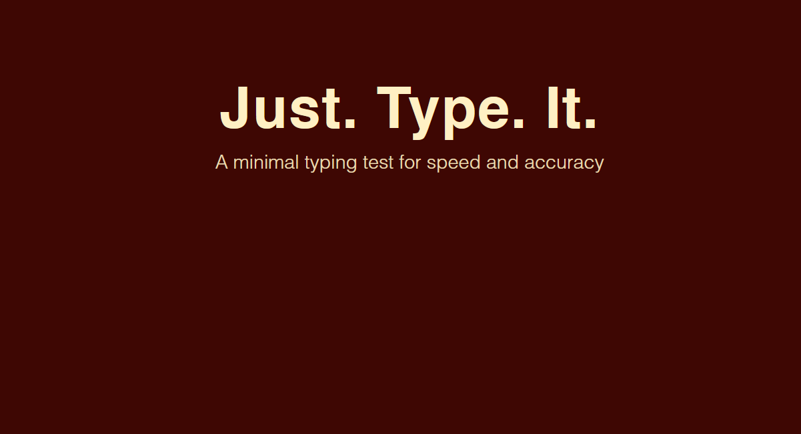
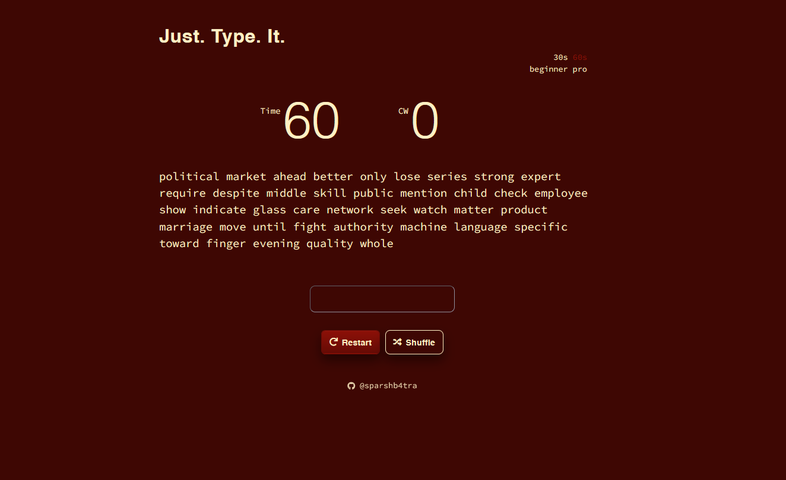

# Just. Type. It.

A minimal, fast typing test to measure WPM and accuracy.

<p align="center">
  
</p>

### Features
- Timed tests: 30s or 60s
- Difficulty: beginner or pro word lists
- Live accuracy and WPM
- Shuffle before start, restart anytime
- Keyboard-first UX, responsive layout

### Tech
- HTML + CSS (no frameworks)
- Vanilla JS
- Fonts: Helvetica stack for UI, Source Code Pro for text

### Theming
Current palette:
- Background `#3E0703`
- Accents `#660B05`, `#8C1007`
- Text `#FFF0C4`

### Run locally
1. Open `index.html` in a modern browser, or
2. Serve the folder with any static server (examples below).

Node
```bash
npx serve -s .
```

Python
```bash
python -m http.server 8080
```

### Deploy
Live: `https://just-type-it.vercel.app`

This is a static site. Drag-and-drop to Vercel/Netlify, or host on GitHub Pages.

### Screenshots

<p align="center">
  
</p>

### Credits
Originally based on an open-source typing test by Ambresh Vaishya. This fork modernizes the UI and branding.

### Author
Maintained by Sparsh Batra – `@sparshb4tra` (`https://github.com/sparshb4tra`).

### License
MIT – see `LICENSE`.
